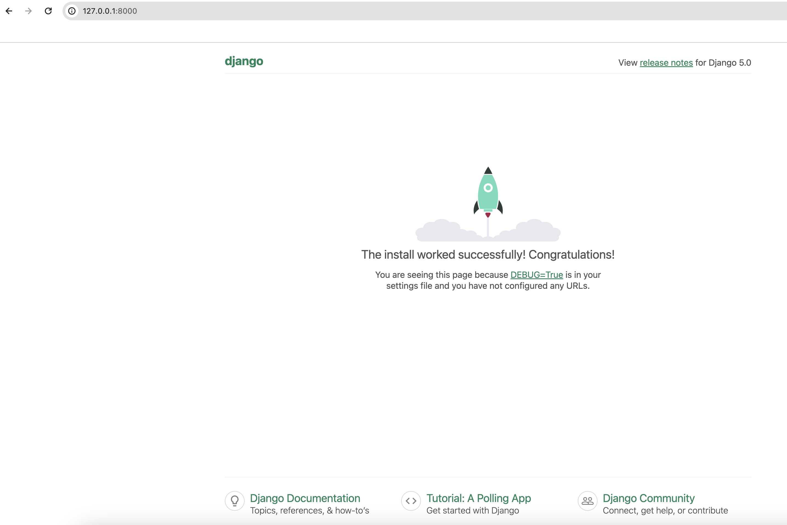
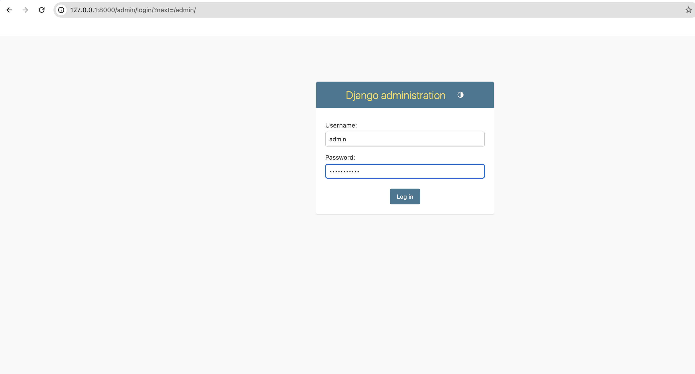
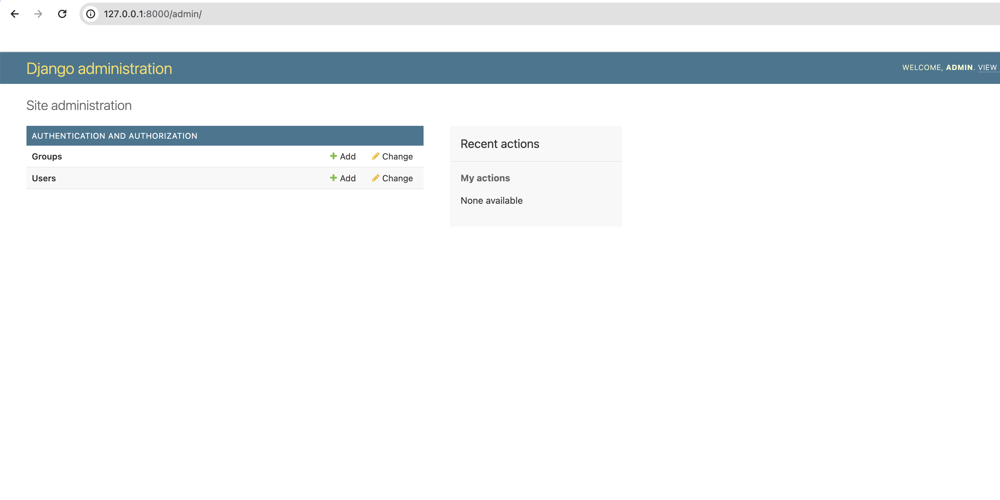
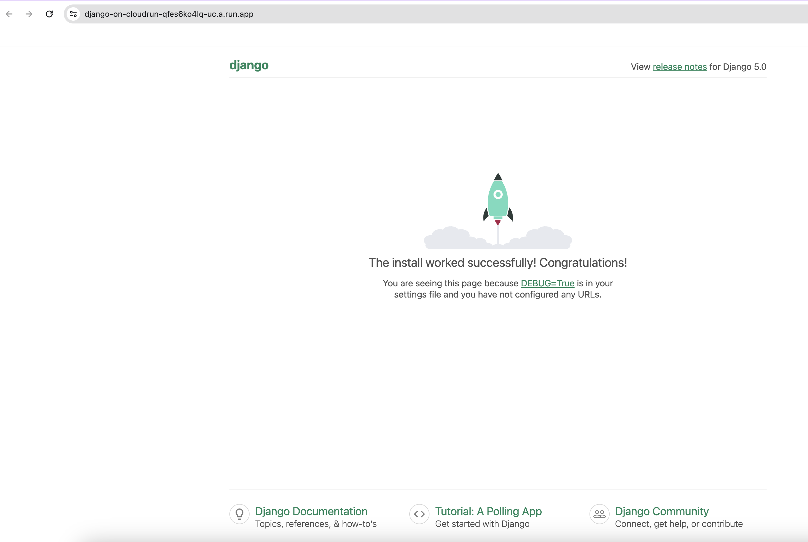
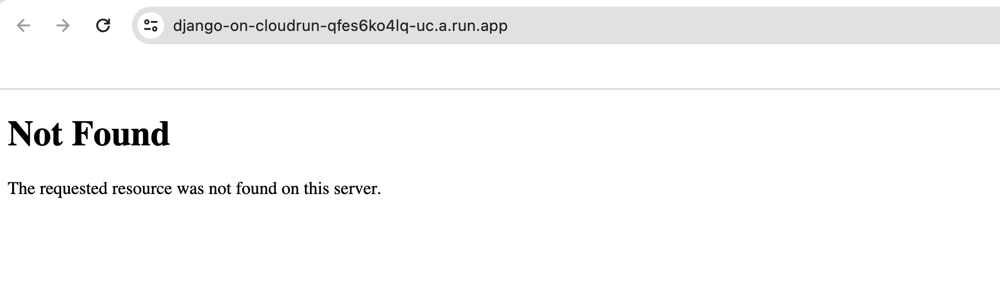

## Introduction

Deploying a Django application to a production environment may require you to perform the following tasks:

- Provision hardware or virtual machines to run the application and database server
- Install the required software on the provisioned servers
- Purchase a domain from a registar for and setup the relevant DNS records to associate the domain with your app
- Setup a webserver to terminate HTTP(S) traffic to your application
- Obtain and congiure SSL certificate to secure traffic to the application

## Goole Cloud Run

[Cloud Run](https://cloud.google.com/run) is a managed platform that enables you to run container based workloads on top of Google infrastructure.  
Cloud Run automates many of the above steps and allows you to focus on developing and deploying updates to your application.

Some of the benefits include:

- Run code written in any programming language on cloud run if you can package into a container
- Source based deployments using build packs for supported languages making an explicit container packaging step optional.
- Support for **services** which respond to web requests, and one-off **jobs** which run and exit after doing some work
- A generous free tier and pay-per-use based pricing.
- Services automatically receive unique https endpoints on a `run.app` sub domain with support for custom domains
- Auto-scaling which automatically adds and removes running container instances in response to web traffic or resource utilization

## Infrastructure as Code

You have 3 options when installing an application on Google Cloud:

- Using the web based console
- Using the `gcloud` tool
- Using an automated provisioning tool such as Terraform

This tutorial uses the [Terraform](https://www.terraform.io/) tool to create a repeatable recipe for deploying a Django application to Google Cloud Run and provisioning the backing services.

## Google Cloud Components

You will use the following Google Cloud components:

- [Cloud Run](https://cloud.google.com/run): managed compute platform to run container based **services** which respond to web requests or **jobs** which run to completion
- [Artifact Registry](https://cloud.google.com/artifact-registry): artifact storage to manage container images.
- [Cloud SQL](https://cloud.google.com/sql): managed relational database service for MySQL, PostgreSQL, and SQL Server.
- [Cloud Storage](https://cloud.google.com/storage): blog storage for static assets and media files
- [Secret Manager](https://cloud.google.com/secret-manager): secure storage for sensitive data e.g passwords.

## Step 0 - Installing the supporting tools

Install the Google Cloud CLI by following the intructions [here](https://cloud.google.com/sdk/docs/install).

Initialize the gcloud CLI by run the following command:

```sh
gcloud init
```

Install Terraform by following the intructions [here](https://developer.hashicorp.com/terraform/install).

## Step 1 - Creating a Google Cloud project

Create a new Google Cloud project:

```sh
gcloud projects create --name django-on-cloud-run --set-as-default
```

Type `y` at the prompt and press `enter`:

```
No project id provided.

Use [django-on-cloud-run-409907] as project id (Y/n)?  y
```

[Enable billing](https://cloud.google.com/billing/docs/how-to/modify-project) on the project to allow usage of the required Google Cloud APIs within the project.

Set an environment variable for the generated project ID by running the following command.

```
PROJECT_ID=$(gcloud config get-value project)
```

Obtain credentials to enable Terraform to make authenticated requests to Google Cloud

```sh
gcloud auth application-default login --project $PROJECT_ID
```

## Step 2 - Creating a starter Django project

Create a directory to host the project source code

```
mkdir django-on-cloudrun && cd django-on-cloudrun
```

Create 2 subfolders for the Django application code and the Terraform infrastructure code

```
mkdir {djangocloudrun,terraform}
```

The `djangocloudrun` subfolder will contain the Django/Python code and the `terraform` folder will contain the infrastructure provisioning code.

Create a python virtual enviroment to isolate the project dependencies

```
python -m venv venv
```

Activate the Python virtual environment

```
source venv/bin/activate
```

Go to the `djangocloudrun` subfolder

```
cd djangocloudrun
```

Create a `requirements.txt` file with the following content

```sh
# django-on-cloudrun/djangocloudrun/requirements.txt
Django==5.0
django-environ==0.10.0
django-storages[google]==1.13.2
google-cloud-run==0.10.1
gunicorn==20.1.0
psycopg2-binary==2.9.9
```

- `django-environ`: used to read application settings from the environment.
- `django-storages[google]`: used to integrate with Google Cloud Storage for static assets management
- `google-cloud-run`: used to read service metadata on startup
- `gunicorn`: WSGI application server for the Django application
- `psycopg2-binary`: used to communicate with the managed Cloud SQL PostgreSQL instance

Install the project dependencies

```sh
 pip install -r requirements.txt
```

After the dependencies are installed create a starter Django project using the `django-admin` tool

```sh
django-admin startproject djangocloudrun .
```

View your project structure by running this command

```sh
tree
```

You project structure should look like this

```sh
.
├── djangocloudrun
│   ├── __init__.py
│   ├── asgi.py
│   ├── settings.py
│   ├── urls.py
│   └── wsgi.py
├── manage.py
└── requirements.txt
```

Rename the default generated `settings.py` file to `basesettings.py`

```sh
mv djangocloudrun/settings.py djangocloudrun/basesettings.py
```

Create a new `settings.py` file with the following content

```python
# django-on-cloudrun/djangocloudrun/djangocloudrun/settings.py
import io
import os
from urllib.parse import urlparse

import environ
import google.auth
import requests
from google.cloud.run_v2.services.services.client import ServicesClient


from .basesettings import *


env = environ.Env()
if env("APPLICATION_SETTINGS", default=None):
    env.read_env(io.StringIO(os.environ.get("APPLICATION_SETTINGS", None)))
else:
    env_file = BASE_DIR / ".env"
    env.read_env(env_file)


SECRET_KEY = env("SECRET_KEY")
DEBUG = env("DEBUG", default=False)
DATABASES = {"default": env.db()}
SERVICE_NAME = env("SERVICE_NAME", default=None)

try:
    _, PROJECT_ID = google.auth.default()
except google.auth.exceptions.DefaultCredentialsError:
    PROJECT_ID = env("PROJECT_ID", default=None)

try:
    response = requests.get(
        "http://metadata.google.internal/computeMetadata/v1/instance/region",
        headers={"Metadata-Flavor": "Google"},
    )
    REGION = response.text.split("/")[-1]
except requests.exceptions.ConnectionError:
    REGION = None

if all((PROJECT_ID, REGION, SERVICE_NAME)):
    service_path = f"projects/{PROJECT_ID}/locations/{REGION}/services/{SERVICE_NAME}"
    client = ServicesClient()
    service_uri = client.get_service(name=service_path).uri
    ALLOWED_HOSTS = [urlparse(service_uri).netloc]
    CSRF_TRUSTED_ORIGINS = [service_uri]
else:
    ALLOWED_HOSTS = ["*"]

if GS_BUCKET_NAME := env("STATICFILES_BUCKET_NAME", default=None):
    STATICFILES_DIRS = []
    GS_DEFAULT_ACL = "publicRead"
    STORAGES = {
        "default": {
            "BACKEND": "storages.backends.gcloud.GoogleCloudStorage",
        },
        "staticfiles": {
            "BACKEND": "storages.backends.gcloud.GoogleCloudStorage",
        },
    }
```

Create a `.env` file in the Django project root with the following content

```sh
# django-on-cloudrun/djangocloudrun/.env
SECRET_KEY="django-insecure-secret-key"
DATABASE_URL=sqlite:////tmp/db.sqlite3
DEBUG=on
```

Create a `Procfile` file in the Django project root with the following content

```sh
# django-on-cloudrun/djangocloudrun/Procfile
web: gunicorn --bind 0.0.0.0:$PORT --workers 1 --threads 8 --timeout 0 djangocloudrun.wsgi:application
migrate_collectstatic: python manage.py migrate && python manage.py collectstatic --noinput --clear
create_superuser: python manage.py createsuperuser --username admin --email noop@example.com --noinput
```

A Procfile lists the web application entry points that are executed by Cloud Run service and jobs.

- The `web` default entry point runs the application
- The `migrate_collecstatic` entry point is executed by a job to run database migrations and copy static files to Cloud Storage

* The `create_superuser` entry point is executed by a job to create a Django superuser

## Step 3 - Running the application locally

Initialize the sqlite database by running migrations

```sh
python manage.py migrate
```

You should see output similar to this if migrations are run successfully

```
Operations to perform:
  Apply all migrations: admin, auth, contenttypes, sessions
Running migrations:
  Applying contenttypes.0001_initial... OK
  Applying auth.0001_initial... OK
  Applying admin.0001_initial... OK
  Applying admin.0002_logentry_remove_auto_add... OK
  Applying admin.0003_logentry_add_action_flag_choices... OK
  Applying contenttypes.0002_remove_content_type_name... OK
  Applying auth.0002_alter_permission_name_max_length... OK
  Applying auth.0003_alter_user_email_max_length... OK
  Applying auth.0004_alter_user_username_opts... OK
  Applying auth.0005_alter_user_last_login_null... OK
  Applying auth.0006_require_contenttypes_0002... OK
  Applying auth.0007_alter_validators_add_error_messages... OK
  Applying auth.0008_alter_user_username_max_length... OK
  Applying auth.0009_alter_user_last_name_max_length... OK
  Applying auth.0010_alter_group_name_max_length... OK
  Applying auth.0011_update_proxy_permissions... OK
  Applying auth.0012_alter_user_first_name_max_length... OK
  Applying sessions.0001_initial... OK
```

Create a superuser account for logging into the Django admin interface

```sh
python manage.py createsuperuser --username admin --email admin@example.com
```

When prompted enter a password of your choice and confirm

```sh
Password:
Password (again):
Superuser created successfully.
```

Run the developement server

```sh
python manage.py runserver
```

The server starts up and prints output similar to this:

```sh
Watching for file changes with StatReloader
Performing system checks...

System check identified no issues (0 silenced).
January 01, 2024 - 08:32:11
Django version 5.0, using settings 'django_cloudrun.settings'
Starting development server at http://127.0.0.1:8000/
Quit the server with CONTROL-C.
```

Navigate to http://127.0.0.1:8000 in your web browser and you will see the Django welcome page



Navigate to the Django admin site `http://127.0.0.1:8000/admin` and login using the `admin` username and the superuser password you set.



The Django admin dashboard is displayed



## Step 4 - Deploying the app to Cloud Run using Terraform

Create a Cloud Storage bucket to store Terraform state using the `gsutil` tool which is bundled with the `gcloud` installation

```sh
gsutil mb gs://${PROJECT_ID}-tfstate
```

Enable Object Versioning on the storage bucket to keep a history of Terraform state:

```sh
gsutil versioning set on gs://${PROJECT_ID}-tfstate
```

Go to the `terraform` subfolder

```sh
cd ../terraform
```

Create a `variables.tf` file with the following content

```terraform
# django-on-cloudrun/terraform/variables.tf
variable "project" {
  type        = string
  description = "Google Cloud Project ID"
}

variable "region" {
  type        = string
  default     = "us-central1"
  description = "Google Cloud Region"
}

variable "service_name" {
  type        = string
  description = "Name of Cloud Run service"
}
```

Create a `terraform.tfvars` file with the following content.
Replace the `PROJECT_ID` placeholder with the value of the `PROJECT_ID` environment variable you set earlier.

```terraform
# django-on-cloudrun/terraform/terraform.tfvars
project      = "PROJECT_ID"
service_name = "django-on-cloudrun"
```

Create a `templates` subfolder

```sh
mkdir templates
```

Crete a `application_settings.tftpl` within the `templates` subfolder with the following content

```terraform
# django-on-cloudrun/terraform/templates/application_settings.tftpl
DATABASE_URL="postgres://${user.name}:${user.password}@//cloudsql/${instance.project}:${instance.region}:${instance.name}/${database.name}"
STATICFILES_BUCKET_NAME="${staticfiles_bucket}"
SECRET_KEY="${secret_key}"
DEBUG=on
```

Create a `main.tf` file with the following content.
Replace the `PROJECT_ID` placeholder with the value of the `PROJECT_ID` environment variable you set earlier.

```terraform
# django-on-cloudrun/terraform/main.tf
terraform {
  required_providers {
    google = {
      source  = "hashicorp/google"
      version = "~> 5.9.0"
    }

    random = {
      version = "~> 3.6.0"
    }
  }
}

# Store Terraform state in a Google Cloud Storage bucket
terraform {
  backend "gcs" {
    bucket = "PROJECT_ID-tfstate"
  }
}

provider "google" {
  project = var.project
}

# Enable the required Google Cloud APIs
resource "google_project_service" "all" {
  for_each = toset([
    "artifactregistry.googleapis.com",
    "cloudbuild.googleapis.com",
    "compute.googleapis.com",
    "run.googleapis.com",
    "secretmanager.googleapis.com",
    "sql-component.googleapis.com",
    "sqladmin.googleapis.com",
  ])
  project            = var.project
  service            = each.key
  disable_on_destroy = false
}

# Create a service account for the Cloud Run service
resource "google_service_account" "django_cloudrun" {
  account_id = "django-run-sa"
  project    = var.project
}

# Create a Artifact Repository to store the application image
resource "google_artifact_registry_repository" "main" {
  format        = "DOCKER"
  location      = var.region
  project       = var.project
  repository_id = "django-app"

  depends_on = [
    google_project_service.all
  ]
}

# Provision a database server instance for the application
resource "google_sql_database_instance" "main" {
  name             = "django"
  database_version = "POSTGRES_14"
  region           = var.region
  settings {
    tier = "db-f1-micro"
  }
  deletion_protection = true

  depends_on = [
    google_project_service.all
  ]
}

# Create a database within the instance
resource "google_sql_database" "main" {
  name     = "django"
  instance = google_sql_database_instance.main.name
}

# Create a random password for the app database user
resource "random_password" "db_password" {
  length  = 32
  special = false
}

# Create the Django application database user
resource "google_sql_user" "django" {
  name     = "django"
  instance = google_sql_database_instance.main.name
  password = random_password.db_password.result
}

# Define local variables
locals {
  service_account = "serviceAccount:${google_service_account.django_cloudrun.email}"
  repository_id   = google_artifact_registry_repository.main.repository_id
  ar_repository   = "${var.region}-docker.pkg.dev/${var.project}/${local.repository_id}"
  image           = "${local.ar_repository}/${var.service_name}:bootstrap"
}

# Assign the Cloud Run service the required roles to connect to the DB and fetch service metadata
resource "google_project_iam_member" "service_roles" {
  for_each = toset([
    "cloudsql.client",
    "run.viewer",
  ])
  project = var.project
  role    = "roles/${each.key}"
  member  = local.service_account
}

# Create a Cloud Storage bucket to store static files
resource "google_storage_bucket" "staticfiles" {
  name     = "${var.project}-staticfiles"
  location = "US"
}

# Grant the Cloud Run service account admin access to the staticfiles bucket
resource "google_storage_bucket_iam_binding" "staticfiles_bucket" {
  bucket = google_storage_bucket.staticfiles.name
  role   = "roles/storage.admin"
  members = [
    local.service_account
  ]
}

# Create a random string to use as the Django secret key
resource "random_password" "django_secret_key" {
  special = false
  length  = 50
}

resource "google_secret_manager_secret" "application_settings" {
  secret_id = "application_settings"

  replication {
    auto {}
  }
  depends_on = [google_project_service.all]

}

# Replace the Terraform template variables and save the rendered content as a secret
resource "google_secret_manager_secret_version" "application_settings" {
  secret = google_secret_manager_secret.application_settings.id

  secret_data = templatefile("${path.module}/templates/application_settings.tftpl", {
    staticfiles_bucket = google_storage_bucket.staticfiles.name
    # media_bucket       = google_storage_bucket.media.name
    secret_key = random_password.django_secret_key.result
    user       = google_sql_user.django
    instance   = google_sql_database_instance.main
    database   = google_sql_database.main
  })
}

# Grant the Cloud Run service account access to the application settings secret
resource "google_secret_manager_secret_iam_binding" "application_settings" {
  secret_id = google_secret_manager_secret.application_settings.id
  role      = "roles/secretmanager.secretAccessor"
  members   = [local.service_account]
}

# Generate a random password for the superuser
resource "random_password" "superuser_password" {
  length  = 32
  special = false
}

# Save the superuser password as a secret
resource "google_secret_manager_secret" "superuser_password" {
  secret_id = "superuser_password"
  replication {
    auto {}
  }
  depends_on = [google_project_service.all]
}

resource "google_secret_manager_secret_version" "superuser_password" {
  secret      = google_secret_manager_secret.superuser_password.id
  secret_data = random_password.superuser_password.result
}

# Grant the Cloud Run service account access to the superuser password secret
resource "google_secret_manager_secret_iam_binding" "superuser_password" {
  secret_id = google_secret_manager_secret.superuser_password.id
  role      = "roles/secretmanager.secretAccessor"
  members   = [local.service_account]
}

# Build the application image that the Cloud Run service and jobs will use
resource "terraform_data" "bootstrap" {
  provisioner "local-exec" {
    working_dir = "${path.module}/../djangocloudrun"
    command     = "gcloud builds submit --pack image=${local.image} ."
  }

  depends_on = [
    google_artifact_registry_repository.main,
    google_project_service.all
  ]
}

# Create the migrate_collectstatic Cloud Run job
resource "google_cloud_run_v2_job" "migrate_collectstatic" {
  name     = "migrate-collectstatic"
  location = var.region

  template {
    template {
      service_account = google_service_account.django_cloudrun.email

      volumes {
        name = "cloudsql"
        cloud_sql_instance {
          instances = [google_sql_database_instance.main.connection_name]
        }
      }

      containers {
        image   = local.image
        command = ["migrate_collectstatic"]

        env {
          name = "APPLICATION_SETTINGS"
          value_source {
            secret_key_ref {
              version = google_secret_manager_secret_version.application_settings.version
              secret  = google_secret_manager_secret_version.application_settings.secret
            }
          }
        }

        volume_mounts {
          name       = "cloudsql"
          mount_path = "/cloudsql"
        }

      }
    }
  }

  depends_on = [
    terraform_data.bootstrap,
  ]
}

# Create the create_superuser Cloud Run job
resource "google_cloud_run_v2_job" "create_superuser" {
  name     = "create-superuser"
  location = var.region

  template {
    template {
      service_account = google_service_account.django_cloudrun.email

      volumes {
        name = "cloudsql"
        cloud_sql_instance {
          instances = [google_sql_database_instance.main.connection_name]
        }
      }

      containers {
        image   = local.image
        command = ["create_superuser"]

        env {
          name = "APPLICATION_SETTINGS"
          value_source {
            secret_key_ref {
              version = google_secret_manager_secret_version.application_settings.version
              secret  = google_secret_manager_secret_version.application_settings.secret
            }
          }
        }

        env {
          name = "DJANGO_SUPERUSER_PASSWORD"
          value_source {
            secret_key_ref {
              version = google_secret_manager_secret_version.superuser_password.version
              secret  = google_secret_manager_secret_version.superuser_password.secret
            }
          }
        }

        volume_mounts {
          name       = "cloudsql"
          mount_path = "/cloudsql"
        }

      }
    }
  }

  depends_on = [
    terraform_data.bootstrap
  ]
}

# Run the migrate_collectstatic the Cloud Run job
resource "terraform_data" "execute_migrate_collectstatic" {
  provisioner "local-exec" {
    command = "gcloud run jobs execute migrate-collectstatic --region ${var.region} --wait"
  }

  depends_on = [
    google_cloud_run_v2_job.migrate_collectstatic,
  ]
}

# Run the create_superuser the Cloud Run job
resource "terraform_data" "execute_create_superuser" {

  provisioner "local-exec" {
    command = "gcloud run jobs execute create-superuser --region ${var.region} --wait"
  }

  depends_on = [
    google_cloud_run_v2_job.create_superuser,
  ]
}

# Create and deploy the Cloud Run service
resource "google_cloud_run_service" "app" {
  name                       = var.service_name
  location                   = var.region
  autogenerate_revision_name = true

  lifecycle {
    replace_triggered_by = [terraform_data.bootstrap]
  }

  template {
    spec {
      service_account_name = google_service_account.django_cloudrun.email
      containers {
        image = local.image

        env {
          name  = "SERVICE_NAME"
          value = var.service_name
        }

        env {
          name = "APPLICATION_SETTINGS"
          value_from {
            secret_key_ref {
              key  = google_secret_manager_secret_version.application_settings.version
              name = google_secret_manager_secret.application_settings.secret_id
            }
          }
        }
      }
    }

    metadata {
      annotations = {
        "autoscaling.knative.dev/maxScale"      = "1"
        "run.googleapis.com/cloudsql-instances" = google_sql_database_instance.main.connection_name
        "run.googleapis.com/client-name"        = "terraform"
      }
    }


  }

  traffic {
    percent         = 100
    latest_revision = true
  }

  depends_on = [
    terraform_data.execute_migrate_collectstatic,
    terraform_data.execute_create_superuser,
  ]

}

# Grant permission to unauthenticated users to invoke the Cloud Run service
data "google_iam_policy" "noauth" {
  binding {
    role    = "roles/run.invoker"
    members = ["allUsers"]
  }
}

resource "google_cloud_run_service_iam_policy" "noauth" {
  location = google_cloud_run_service.app.location
  project  = google_cloud_run_service.app.project
  service  = google_cloud_run_service.app.name

  policy_data = data.google_iam_policy.noauth.policy_data
}

# Print the Cloud Run service url
output "service_url" {
  value = google_cloud_run_service.app.status[0].url
}
```

Initialize Terraform by running the following command

```sh
terraform init
```

You will see printed output similar to this on successfuly initialization

```
Initializing the backend...

Successfully configured the backend "gcs"! Terraform will automatically
use this backend unless the backend configuration changes.

Initializing provider plugins...
- terraform.io/builtin/terraform is built in to Terraform
- Finding hashicorp/google versions matching "~> 5.9.0"...
- Finding hashicorp/random versions matching "~> 3.6.0"...
- Installing hashicorp/google v5.9.0...
- Installed hashicorp/google v5.9.0 (signed by HashiCorp)
- Installing hashicorp/random v3.6.0...
- Installed hashicorp/random v3.6.0 (signed by HashiCorp)

Terraform has created a lock file .terraform.lock.hcl to record the provider
selections it made above. Include this file in your version control repository
so that Terraform can guarantee to make the same selections by default when
you run "terraform init" in the future.

Terraform has been successfully initialized!

You may now begin working with Terraform. Try running "terraform plan" to see
any changes that are required for your infrastructure. All Terraform commands
should now work.

If you ever set or change modules or backend configuration for Terraform,
rerun this command to reinitialize your working directory. If you forget, other
commands will detect it and remind you to do so if necessary.
```

Run `terraform plan` to review the resource terraform will create in Google Cloud

```sh
terraform plan
```

The plan will display the number of resources that will be added

```sh
Plan: 32 to add, 0 to change, 0 to destroy.

Changes to Outputs:
  + service_url = (known after apply)
```

Run `terraform apply` to create the resources in Google Cloud and deploy the Cloud Run service

```sh
terraform apply
```

Type `yes` at the prompt and press `enter:`

```sh
Plan: 32 to add, 0 to change, 0 to destroy.

Changes to Outputs:
  + service_url = (known after apply)

Do you want to perform these actions?
  Terraform will perform the actions described above.
  Only 'yes' will be accepted to approve.

  Enter a value: yes
```

The process will take a while to create all the resources and display output similar to this on completion.

```sh
Apply complete! Resources: 32 added, 0 changed, 0 destroyed.

Outputs:

service_url = "https://django-on-cloudrun-qfes6ko4lq-uc.a.run.app"
```

Copy the printed value of `service_url`

## Step 5 - Logging into the application

Visit the service url in your browser and you will see the Django welcome page



Navigate to the Django Admin login page by appending `/admin` to your service URL.

https://django-on-cloudrun-qfes6ko4lq-uc.a.run.app/admin

Retrieve the superuser password using the following command:

```sh
gcloud secrets versions access latest --secret superuser_password && echo ""
```

Login with the username `admin` and the retrieved password.

## Step 6 - Disabling DEBUG mode

Modify the `templates/application_settings.tftpl` file and change the `DEBUG` value from `on` to `off`.

The updated file should look like this

```terraform
DATABASE_URL="postgres://${user.name}:${user.password}@//cloudsql/${instance.project}:${instance.region}:${instance.name}/${database.name}"
STATICFILES_BUCKET_NAME="${staticfiles_bucket}"
SECRET_KEY="${secret_key}"
DEBUG=off
```

Run `teraform plan` to review the changes

```sh
terraform plan
```

Terraform will display a plan of the actions to make the desired change

```sh
...

  ~ update in-place
-/+ destroy and then create replacement

Terraform will perform the following actions:

....

Plan: 1 to add, 3 to change, 1 to destroy.
```

Run `teraform apply` to perform the desired changes

```sh
terraform apply
```

Type `yes` at the prompt and press `enter`:

```sh
...

Plan: 1 to add, 3 to change, 1 to destroy.

Do you want to perform these actions?
  Terraform will perform the actions described above.
  Only 'yes' will be accepted to approve.

  Enter a value: yes
```

Terraform will update the secret and redeploy the service then print the service url on completion.

```sh
Apply complete! Resources: 1 added, 3 changed, 1 destroyed.

Outputs:

service_url = "https://django-on-cloudrun-qfes6ko4lq-uc.a.run.app"
```

Visit the service URL and confirm that the welcome page is not displayed anymore when `DEBUG` mode is disabled.


## Step 7 - Cleaning Up

In order not incur unnecessary cost you can delete the project.

This action will delete all the resources you created in the previous steps.

```sh
gcloud projects delete ${PROJECT_ID}
```

Type `y` at the prompt and press `enter`:

```sh
Your project will be deleted.

Do you want to continue (Y/n)?  y
```

After the project is deleted you will see a message like this

```sh
Deleted [https://cloudresourcemanager.googleapis.com/v1/projects/django-on-cloud-run-409909].
...
```

[The Source code for this article can be found here.](https://github.com/joshwizzy/django-on-cloudrun)
